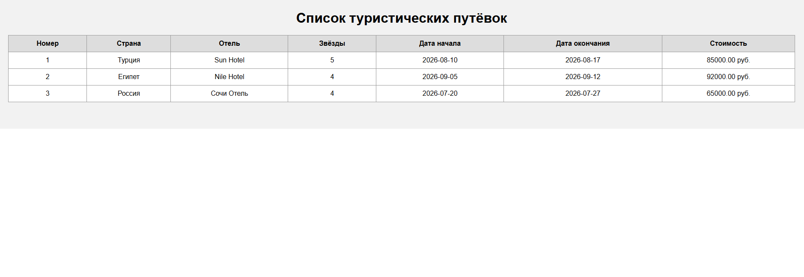
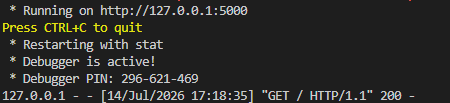

# Кейс-задача № 4. WEB-приложение «Туризм»

Приложение получает сведения о туристических путёвках из базы данных MySQL и отображает их в браузере.

## Быстрый запуск на Ubuntu

### 1. Скачать репозиторий

```bash
git clone https://github.com/Barbarossa5296/synergy-practice.git
cd synergy-practice/case_4
```

### 2. Установить Python и MySQL

```bash
sudo apt update
sudo apt install -y python3-venv mysql-server
sudo service mysql start
```

### 3. Создать базу данных

```bash
sudo mysql < database.sql
```

Скрипт создаст базу данных `tourism`, пять связанных таблиц и тестовые записи.

### 4. Создать пользователя MySQL

```bash
sudo mysql <<'SQL'
DROP USER IF EXISTS 'tourism_user'@'localhost';

CREATE USER 'tourism_user'@'localhost'
IDENTIFIED BY 'Tourism_2026!';

GRANT ALL PRIVILEGES ON tourism.*
TO 'tourism_user'@'localhost';

FLUSH PRIVILEGES;
SQL
```

### 5. Установить библиотеки Python

```bash
python3 -m venv .venv
source .venv/bin/activate
python -m pip install -r requirements.txt
```

### 6. Запустить приложение

```bash
export TOURISM_DB_PASSWORD='Tourism_2026!'
python app.py
```

После запуска в терминале появится адрес:

```text
http://127.0.0.1:5000
```

Его необходимо открыть в браузере.

Для остановки приложения используется сочетание клавиш `Ctrl + C`.

## Повторный запуск

Откройте терминал в корне репозитория `synergy-practice`, после чего выполните:

```bash
cd case_4

sudo service mysql start

source .venv/bin/activate

export TOURISM_DB_PASSWORD='Tourism_2026!'

python app.py
```

После запуска приложение будет доступно по адресу:

```text
http://127.0.0.1:5000
```

Если терминал открыт в другой папке, сначала необходимо перейти в папку клонированного репозитория.

## Структура проекта

```case_4/
├── screenshots/
│   ├── application.png
│   └── server.png
├── templates/
│   └── index.html
├── app.py
├── database.sql
├── market_analysis.md
├── README.md
└── requirements.txt
```

- `app.py` — серверная часть приложения на Flask;
- `database.sql` — создание базы данных и тестовых записей;
- `requirements.txt` — необходимые библиотеки Python;
- `templates/index.html` — HTML-страница со списком путёвок.

## Как работает приложение

1. Пользователь открывает страницу в браузере.
2. Flask принимает HTTP-запрос.
3. Python подключается к MySQL.
4. Выполняется SQL-запрос к таблицам `tours`, `hotels` и `countries`.
5. Полученные данные передаются в HTML-шаблон.
6. В браузере отображается таблица туристических путёвок.

## Выбор технологий

В исходном задании указаны Delphi 10.2, IIS и MS SQL Server. В рамках текущего обучения я в основном работаю с Python и ранее уже использовал MySQL, поэтому для создания рабочего прототипа выбрал знакомый мне стек: Python, Flask и MySQL.

Для создания рабочего прототипа использованы Python, Flask и MySQL.

Python является основным языком, используемым при обучении по профилю «Искусственный интеллект и большие данные». Flask позволяет создать простое WEB-приложение с минимальным количеством файлов. MySQL использована потому, что база данных предметной области «Туризм» была разработана в кейсе № 3.

Приложение демонстрирует основные элементы WEB-архитектуры: обработку HTTP-запросов, взаимодействие с базой данных и формирование динамической HTML-страницы.

## Результат работы

### Интерфейс приложения



### Запуск WEB-сервера

